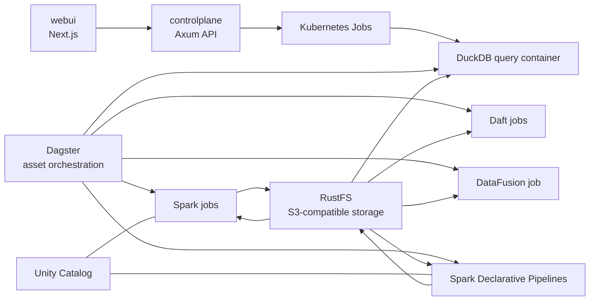

# Mizumi

Mizumi is a local data platform playground built around Kubernetes. It combines object storage, Spark batch processing, Spark Declarative Pipelines, Dagster orchestration, and query engines such as DuckDB, DataFusion, and Daft.

The repository is organized as infrastructure plus a small application layer:

- `packages/spark`: Spark jobs and Spark Declarative Pipelines.
- `packages/dagster`: Dagster asset definitions that orchestrate jobs on Kubernetes.
- `packages/duckdb`, `packages/datafusion`, `packages/daft`: query and compute workloads packaged as container jobs.
- `packages/unitycatalog`: Unity Catalog container build context.
- `controlplane`: Rust API that launches ad hoc DuckDB query jobs in Kubernetes.
- `webui`: Next.js UI.
- `infra/k8s`: Kubernetes manifests and Helm values.
- `scripts/`: operational entrypoints for deploy, destroy, forward, and per-service redeploy commands.

## Architecture

Mizumi uses RustFS as the S3-compatible storage layer. Spark reads bronze data from RustFS, writes silver and gold outputs back to RustFS, and Spark Declarative Pipelines produce additional managed datasets. Dagster acts as the orchestration layer and triggers Spark, DuckDB, DataFusion, and Daft workloads as Kubernetes jobs. Unity Catalog provides metadata and catalog services. The Rust API exposes an HTTP endpoint that runs one-off DuckDB queries in cluster jobs, and the Next.js UI is the intended frontend surface.

### Data Flow



### Runtime Components

- `RustFS`: stores bronze, silver, gold, and pipeline-managed objects through an S3-compatible endpoint.
- `Spark`: runs Python jobs like `bronze_to_silver.py` and the gold aggregation jobs.
- `Spark Declarative Pipelines`: runs SQL-driven pipelines under `packages/spark/pipelines/*`.
- `Dagster`: defines software-defined assets and launches workloads with `dagster-k8s` and `dagster-spark`.
- `DuckDB`: runs query containers against data stored in RustFS.
- `DataFusion`: runs Arrow/DataFusion queries as Kubernetes jobs.
- `Daft`: supports both simple and distributed jobs, with the distributed mode backed by Ray.
- `Unity Catalog`: supplies catalog services for the Spark-side data platform setup.
- `controlplane`: exposes `/api/query` and creates short-lived DuckDB Kubernetes jobs.
- `webui`: lightweight Next.js frontend deployed separately.

## Repository Layout

```text
.
├── controlplane/             # Rust API for ad hoc query execution
├── webui/                    # Next.js frontend
├── infra/k8s/                # Kubernetes manifests and Helm values
├── packages/
│   ├── dagster/              # Dagster definitions and assets
│   ├── daft/                 # Daft jobs and image
│   ├── datafusion/           # DataFusion jobs and image
│   ├── duckdb/               # DuckDB query jobs and image
│   ├── spark/                # Spark jobs and pipeline specs
│   └── unitycatalog/         # Unity Catalog image context
├── Justfile                  # Main operator command surface
├── pyproject.toml            # Python dependencies for Dagster and data tooling
└── uv.lock                   # Locked Python environment
```

## Main Commands

Most operational commands live in `Justfile`.

### Environment Setup

```bash
uv sync
```

Installs the Python environment used for Dagster and the data packages declared in `pyproject.toml`.

### Platform Lifecycle

```bash
just deploy
```

Deploys the core platform stack:

- RustFS
- Redpanda
- Keycloak
- Unity Catalog
- Spark operator and Spark jobs/pipelines
- Dagster
- Controlplane

```bash
just destroy
```

Tears down the core stack namespaces and workloads.

### Access Local UIs

```bash
just forward
```

Starts the common port-forwards and prints local endpoints for:

- RustFS console on `http://127.0.0.1:9001`
- RustFS S3 API on `http://127.0.0.1:9000`
- Redpanda Kafka on `127.0.0.1:19092`
- Redpanda Admin API on `http://127.0.0.1:9644`
- Redpanda Console on `http://127.0.0.1:8081`
- Keycloak on `http://127.0.0.1:8083`
- Dagster UI on `http://127.0.0.1:8080`
- Unity Catalog API on `http://127.0.0.1:8082`
- Unity Catalog UI on `http://127.0.0.1:3001`
- Web UI on `http://127.0.0.1:3002` when deployed
- Controlplane on `http://127.0.0.1:4000` when deployed

### Observability with SigNoz and OpenTelemetry Operator

SigNoz deployment is handled by:

```bash
scripts/signoz.sh deploy
```

The script deploys the local SigNoz stack, the SigNoz `k8s-infra` collectors,
and the OpenTelemetry Operator. It also installs cert-manager when it is not
already present, because the operator uses webhook certificates.

The default auto-instrumentation resource is applied as:

```text
signoz-infra/signoz-instrumentation
```

Add one of these annotations under `spec.template.metadata.annotations` on a
workload to opt it into auto-instrumentation:

```yaml
instrumentation.opentelemetry.io/inject-python: "signoz-infra/signoz-instrumentation"
instrumentation.opentelemetry.io/inject-nodejs: "signoz-infra/signoz-instrumentation"
instrumentation.opentelemetry.io/inject-java: "signoz-infra/signoz-instrumentation"
```

Python auto-instrumentation exports OTLP over HTTP/protobuf to the in-cluster
SigNoz ingester at `http://signoz-ingester.signoz.svc.cluster.local:4318`.

RustFS exports its native OpenTelemetry signals directly to the same in-cluster
SigNoz ingester through `infra/k8s/rustfs/helm/values.yaml`. The Helm values set
`RUSTFS_OBS_ENDPOINT` plus signal-specific `/v1/metrics`, `/v1/traces`, and
`/v1/logs` endpoints, and identify the service as `rustfs` with Mizumi resource
attributes. Redeploy RustFS after changing these values:

```bash
scripts/redeploy-rustfs.sh
```

Dagster-launched Spark assets opt into SigNoz automatically. The shared Spark
job launcher in `packages/dagster/defs_pkg/assets/cross_sell_pipeline.py` adds
the Java auto-instrumentation annotation and OTEL resource attributes for each
ephemeral Spark pod, including the Dagster op name, selected asset keys, run id,
and Spark job path.

You can also forward individual services:

```bash
just rustfs-forward
just redpanda-forward
just dagster-forward
just spark-forward
just spark-pipeline-forward
just unitycatalog-forward
just unitycatalog-ui-forward
just forward
just forward
just daft-distributed-forward
just ballista-forward
```

`redpanda-deploy` also runs a bootstrap job that creates the default `mizumi-orders` topic.

### HTTPS S3 Endpoint Alias

If you need clients to talk to RustFS through `https://s3.ap-southeast-1.amazonaws.com`, this repo includes a local Caddy config at `infra/caddy/Caddyfile` that terminates TLS for that hostname and proxies to `http://127.0.0.1:9000`.

Required local machine steps:

```bash
# 1. Start RustFS locally first
just forward

# 2. Map the AWS hostname to localhost
echo '127.0.0.1 s3.ap-southeast-1.amazonaws.com' | sudo tee -a /etc/hosts

# 3. Trust Caddy's local CA for the generated certificate
just caddy-s3-trust

# 4. Run the HTTPS proxy
just caddy-s3-proxy
```

### Cluster Service Aliases

If you need local clients to talk to in-cluster HTTP service URLs during dev, this repo includes a local Caddy config at `infra/caddy/ClusterServices.Caddyfile` with these mappings:

- `http://keycloak-svc.keycloak.svc.cluster.local` -> `http://127.0.0.1:8083`
- `http://controlplane-svc.controlplane.svc.cluster.local` -> `http://127.0.0.1:4000`

Required local machine steps:

```bash
# 1. Start the local forwards first
just forward

# 2. Map the in-cluster hostnames to localhost
echo '127.0.0.1 keycloak-svc.keycloak.svc.cluster.local controlplane-svc.controlplane.svc.cluster.local' | sudo tee -a /etc/hosts

# 3. Run the HTTP proxy on port 80
just caddy-cluster-services-proxy
```

To create the example Spark streaming job through `controlplane` after `just forward`:

```bash
just jobs-submit-all
```

To rebuild the Spark image and recreate those streaming jobs cleanly, rebuild Spark and resubmit them:

```bash
just spark-image-build
just jobs-submit-all
```

Controlplane-created Spark streaming jobs are also instrumented for SigNoz.
Their SparkApplication driver and executor pods get the Java
auto-instrumentation annotation plus OTEL resource attributes for the streaming
job name, job id, and Spark application file. Restart existing streaming jobs
from the Pipelines UI after redeploying controlplane so Kubernetes recreates the
pods with the new telemetry template.

### Spark and Pipeline Workloads

```bash
just spark-deploy
```

Builds the Spark image, seeds source data, submits the Spark application, and runs the Spark Declarative Pipeline job.

```bash
just spark-destroy
```

Removes the Spark application, pipeline jobs, and Spark-related namespaces.

### Dagster

```bash
just dagster-deploy
just dagster-image-build
just dagster-destroy
```

Use these to build the Dagster image, deploy the Dagster release, or remove it.

### Unity Catalog

```bash
just unitycatalog-deploy
just unitycatalog-bootstrap
just unitycatalog-destroy
```

`unitycatalog-deploy` reuses Dagster's shared Postgres instance, deploys the catalog server and UI, and runs bootstrap initialization.

### Keycloak

```bash
just keycloak-deploy
just keycloak-bootstrap
just keycloak-destroy
```

`keycloak-deploy` installs Keycloak with an in-cluster PostgreSQL database using plain Kubernetes manifests, then runs a bootstrap job that seeds the `mizumi` realm, creates the users `rikki@gmail.com`, `linh@gmail.com`, `khaosoi@gmail.com`, and `khaopad@gmail.com`, and provisions the confidential client `mizumi-client` with direct access grants and service accounts enabled. When `just forward` is running, the admin console is available at `http://127.0.0.1:8083` with the default credentials `admin` / `admin`.

### Query Engines

```bash
just duckdb-query
just datafusion-query
```

These build the relevant images, submit Kubernetes jobs, wait for completion, and stream logs.

Useful follow-up commands:

```bash
just duckdb-query-logs
just duckdb-query-destroy
just datafusion-query-logs
just datafusion-query-destroy
```

### Daft

```bash
just daft-simple-deploy
just daft-distributed-deploy
just daft-destroy
```

Runs either the single-node or distributed Daft quickstart workloads.

### Ballista

```bash
just ballista-deploy
just ballista-status
just ballista-scheduler-logs
just ballista-executor-logs
just ballista-destroy
```

Manages the Ballista cluster manifests under `infra/k8s/ballista`.

### Frontend

For local frontend development:

```bash
cd webui
npm install
npm run dev
```

Other frontend commands:

```bash
cd webui
npm run build
npm run start
npm run lint
npm run format
```

### API

The Rust API can run locally or inside the Kubernetes stack. To run it locally:

```bash
cd controlplane
cargo run
```

It listens on `0.0.0.0:4000` and exposes:

- `GET /livez`
- `GET /readyz`
- `POST /api/query`

`POST /api/query` accepts JSON like:

```json
{
  "sql": "select 1 as ok"
}
```

The handler creates a short-lived DuckDB Kubernetes job in the `spark` namespace, waits for completion, reads the pod logs, and returns parsed JSON rows.

## Orchestration Model

Dagster definitions are assembled in `packages/dagster/defs_pkg/__init__.py`. The main asset groups are:

- `bronze`: source registration for raw orders data.
- `silver` and `gold`: Spark jobs that transform bronze data into curated outputs.
- `sdp`: Spark Declarative Pipeline assets that manage additional silver and gold datasets.
- `duckdb`, `datafusion`, `daft`: compute and query workloads launched as Kubernetes jobs.

At a high level:

1. Bronze data is stored in RustFS.
2. Spark materializes silver and gold data.
3. Spark Declarative Pipelines build additional managed tables.
4. DuckDB and DataFusion query those outputs.
5. Daft provides alternative compute paths, including distributed execution.

## Notes

- The root `README.md` was previously empty, while `webui/README.md` still contains the default Next.js scaffold text.
- `webui` currently contains a minimal placeholder page.
- `controlplane` has Kubernetes manifests under `infra/k8s/controlplane`.
