# Mizumi System Architecture

Mizumi is a Kubernetes-native data platform designed for large distributed
on-premises deployments. It gives organizations cloud-like lakehouse,
analytics, AI, and ML capabilities without spending millions of dollars on
cloud-provider infrastructure or giving up control of sensitive data. The
design keeps data inside the organization's operating boundary and country,
which improves security, data residency, and regulatory control while still
supporting high-performance distributed compute.

The platform is built to be cheaper, easier to customize, and less dependent
on cloud-provider capacity constraints. Teams can tune storage, compute,
networking, GPU allocation, governance, and AI models for their own environment
instead of waiting on external services or competing for scarce hosted GPU
capacity. This helps avoid GPU starvation, improves predictability for ML and
agent workloads, and gives the organization a platform it can evolve as its
business and compliance needs change.

Mizumi supports governed analytics, lakehouse workflows, streaming demos,
interactive SQL, AI-native dashboards, context awareness, AI-assisted
exploration, and ML experimentation. The design centers on a single product
control plane that coordinates user-facing workflows, governance, storage,
compute, identity, and operational state.

The platform is intentionally composed from specialized systems:

- A web UI provides the product experience for catalog browsing, permissions,
  pipelines, analytics, AI-native dashboards, model registry workflows, context
  awareness, agents, and demos.
- A Rust control plane owns platform workflows and is the management boundary
  for user actions, identity-aware decisions, governed data access, storage
  actions, streaming job lifecycle, context-awareness operations, and backend
  system coordination.
- Unity Catalog provides the governed metadata model for catalogs, schemas,
  tables, volumes, permissions, and model-related resources.
- RustFS provides the shared object storage layer for lakehouse data, artifacts,
  generated data, vector tables, and demo assets.
- Dagster models repeatable data transformations as assets and launches
  external compute workloads.
- Spark handles batch lakehouse transformations and streaming workloads.
- DuckDB provides low-latency interactive SQL and uses DuckDB's Quack
  remote protocol for client-server operation.
- LanceDB provides context awareness for AI agents through hybrid search,
  full-text search, and vector search.
- The agent helps non-technical users query, visualize, discover, and request
  governed data access without writing code.
- Dashboards are generated, explained, and edited through the agent so business
  users can express intent instead of translating questions through a separate
  BI or data-analyst layer.
- The synthetic engine provisions sandbox data with LLM and GAN techniques so
  users can experiment while governed access review is still in progress.
- Keycloak provides standards-based identity and authentication.

## High-Level Topology

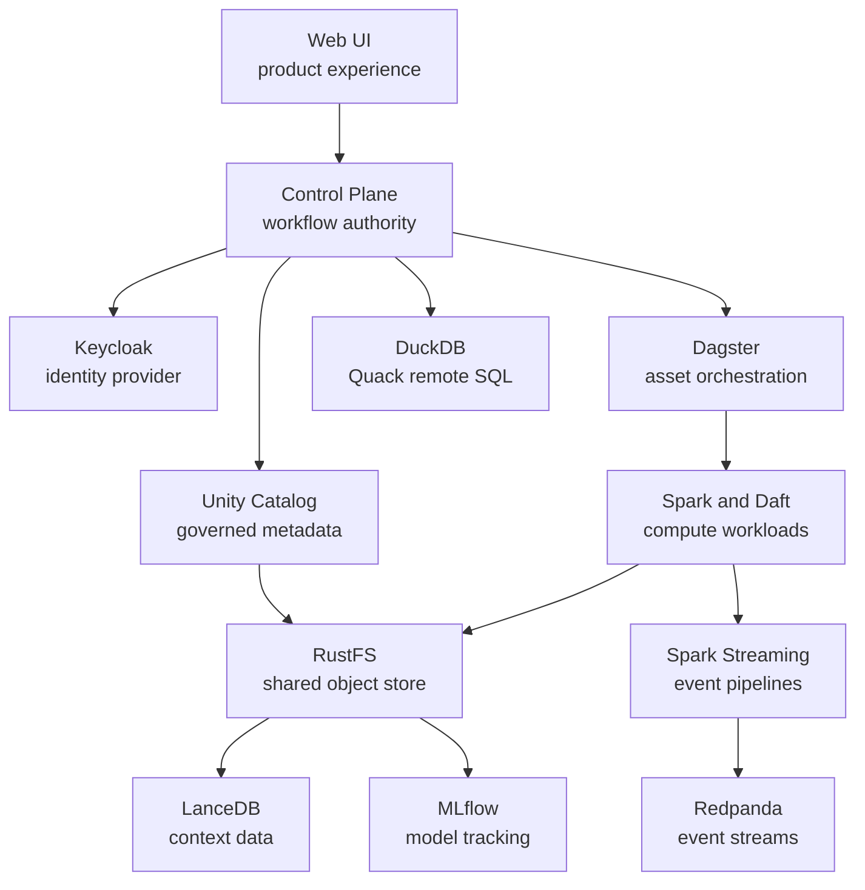

The web UI does not own platform behavior directly. It presents product flows
and delegates privileged or cross-system work to the control plane. Keycloak is
used for identity, while the control plane turns identity context into platform
decisions such as permissions, audit records, governed access, and workflow
execution.

## Component Roles and Design Rationale

| Component | Role in Mizumi | Why it is used |
| --- | --- | --- |
| Web UI | Product shell for catalog, permissions, pipelines, analytics, AI-native dashboards, model registry, context awareness, agents, and demos. | Next.js and React fit an authenticated, interactive platform UI where server-rendered pages and client-side workflows need to coexist. |
| Control plane | Central workflow and policy boundary for the product. It manages Unity Catalog, RustFS, Spark streaming jobs, LanceDB, and backend coordination for web and identity flows. | A single control boundary keeps authorization, auditing, orchestration, and cross-system state consistent instead of spreading product behavior across independent services. |
| Agent | Natural-language assistant for governed data work. | The agent lets non-technical users query accessible data, visualize results, discover datasets, understand lineage, and request access while staying constrained by Unity Catalog governance and control-plane policy. |
| Dashboard | AI-native analytical workspace for panels, charts, explanations, and collaboration. | Business users can describe the outcome they want, and the agent can find governed data, run accessible queries, create visualizations, explain results, and prepare access requests without requiring a separate BI middle layer. |
| Keycloak | Identity provider for user login and token issuance. | Keycloak supports standard identity protocols such as OpenID Connect, OAuth 2.0, and SAML, which makes it suitable for a governed platform that should not invent authentication primitives. |
| Unity Catalog | Governed catalog for data and ML resources, including catalogs, schemas, tables, volumes, permissions, and model metadata. | Unity Catalog's securable object model gives Mizumi a consistent governance layer that can be enforced across query, storage, and workflow surfaces. |
| RustFS | Shared object storage for medallion data, managed data, artifacts, generated files, LanceDB tables, and demo assets. | S3-compatible storage lets Spark, DuckDB, MLflow, LanceDB, and data-generation workflows share a durable data plane without binding the design to one compute engine. |
| Dagster | Asset orchestration for repeatable batch and ML workflows. | Dagster's software-defined asset model keeps lineage, materialization status, and scheduled transformations explicit while still allowing compute to run outside Dagster itself. |
| Spark | Distributed data processing for medallion transformations and streaming jobs. | Spark provides a mature SQL/DataFrame engine for lakehouse transformations, and Structured Streaming gives the same programming model a scalable, fault-tolerant path for event processing. |
| Redpanda | Kafka-compatible event streaming layer. | Kafka compatibility lets Spark streaming jobs and producers use the established Kafka ecosystem while keeping the local platform lightweight. |
| DuckDB | Interactive SQL over governed lakehouse data. | DuckDB is well suited for low-latency analytical queries. DuckDB uses Quack remote protocol so DuckDB can operate as a client-server query service instead of a custom ad hoc query wrapper. |
| LanceDB | Context-awareness layer over platform data using hybrid search, full-text search, and vector search. | LanceDB is designed for AI-native retrieval and disk/object-storage-backed data, which matches Mizumi's need to give agents governed context without creating a separate heavyweight search stack. |
| MLflow | Experiment tracking, artifact management, and model registry workflows. | MLflow provides a standard lifecycle surface for experiments, artifacts, and registered models, keeping ML demos and model workflows inspectable through a familiar system. |
| Daft | Ray-cluster-backed distributed compute for ML training and multimodal data processing. | Daft is designed for AI and multimodal workloads, and pairing it with Ray gives Mizumi a distributed path for image, text, document, and model-training tasks that do not fit the Spark lakehouse processing model cleanly. |
| Synthetic engine | Uses GAN and LLM techniques to generate sandbox datasets and event streams. | Synthetic data speeds up data discovery, enables collaboration without exposing sensitive source data, and gives teams realistic shared datasets for demos, tests, and governance workflows. |

## Control Plane Responsibilities

The control plane is the product authority for actions that cross system
boundaries. It is responsible for:

- Translating authenticated user intent into platform actions.
- Enforcing permission decisions before accessing governed resources.
- Managing Unity Catalog workflows for metadata, grants, and temporary access.
- Managing RustFS-backed storage workflows for generated data, assets, and
  object-backed resources.
- Managing Spark streaming job lifecycle and surfacing job state to the product.
- Managing LanceDB-backed context-awareness operations.
- Managing agent workflows for governed query, visualization, discovery, and
  access requests.
- Managing dashboard workflows for panel generation, explanation,
  visualization, collaboration, and governed access escalation.
- Managing synthetic sandbox workflows for data discovery, experimentation, and
  review-ready workflow capture.
- Coordinating DuckDB query sessions through the Quack protocol.
- Mediating web UI and Keycloak-facing flows so identity context is handled
  consistently.
- Recording audit logs, traces, metrics, lineage, and workflow state across the
  platform.

This design keeps user-facing behavior out of storage, catalog, compute, and
identity systems. Those systems remain specialized engines; the control plane
defines how Mizumi combines them into product workflows.

## Data and Governance Model

Mizumi uses a medallion lakehouse structure:

- Bronze data preserves raw or source-shaped records.
- Silver data contains cleaned, conformed, and joined domain data.
- Gold data contains product-ready aggregates, feature tables, audiences, and
  decision-support outputs.

Unity Catalog governs the logical view of these assets and connects to Keycloak
for user authentication and authorization context. RustFS stores the physical
data and artifacts. The control plane connects the governance and storage layers
by ensuring that catalog operations, permission changes, storage-backed
resources, and user workflows move together.

Governed access is handled as a workflow, not as a direct grant. This keeps
data access repeatable, explainable, time-scoped, and routed through the right
human or automated review path.

### Review Queue

The review queue turns access requests into governed work items. Instead of
granting privileges immediately, Mizumi captures the user's intent, the target
resource, the requested access shape, the business reason, and the active review
state. Reviewers can then evaluate requests consistently, ask for more
information, approve a stage, escalate the request, or reject it.

This design matters because governed access is more than a one-time
allow-or-deny decision. The review queue preserves the context, ownership,
current responsibility, and decision history needed to evaluate, approve, renew,
or revoke access consistently.

### Template Policies

Template policies make common access patterns reusable. A policy can describe
which resources it applies to, what kind of access is expected, who owns the
decision, how risky the request is, how long access may last, and what review
path should be followed.

This prevents every access request from becoming a one-off manual decision.
Low-risk, well-understood requests can move quickly, while sensitive or
mutating access can require additional review. The template becomes the
governance contract for a class of access, and the control plane applies that
contract consistently.

### Blast Radius

Blast-radius analysis connects access review to lineage. Before approving a
request, reviewers need to understand what depends on the resource and what
could be affected by the requested access. A table or schema may feed derived
datasets, scheduled jobs, dashboards, model features, context indexes, or
downstream consumers.

By showing downstream impact, Mizumi shifts governance from "can this user
touch this object?" to "what could happen if this access is granted?" That
makes reviews more informed and helps reviewers choose the right guardrails.

### Time-Bounded Access

Access should expire unless there is an intentional renewal. Mizumi treats
grants as lifecycle-managed objects with a start, an end, renewal paths, and
revocation paths. This keeps temporary collaboration, investigation, and
operational access from turning into permanent permission drift.

Time-bounded access is especially important for cross-team analytics and
partnership workflows. It allows the platform to support fast collaboration
while still giving governance teams a clear way to reduce access over time.
An access request that is low risk today may not stay low risk six months
later: the dataset may gain new sensitive columns, feed more downstream models,
serve more dashboards, or become part of a regulated workflow. Expiration and
renewal force the platform to review the current context again instead of
assuming the original decision is still valid.

### LLM Evaluation

LLM evaluation helps summarize the risk of an access request by reading the
blast-radius context and producing an explanation and guardrail recommendation.
The LLM does not replace reviewers. It helps reviewers understand impact faster,
especially when lineage is broad or the business rationale is ambiguous.

Higher-risk evaluations can recommend tighter guardrails, such as shorter
access duration or additional review. Human reviewers remain responsible for
the final governance decision, while the LLM provides a consistent second read
over the lineage and request context.

This separation is intentional. Unity Catalog is used because governance should
be expressed as metadata and permissions over securable objects, not as
storage-path conventions. Keycloak connects governed access to authenticated
users and authorization decisions. RustFS provides the shared object-storage
data plane. The control plane combines identity, catalog metadata, storage
state, lineage, policy templates, review state, blast-radius evidence, and
time-bounded grants into one governed workflow.

### End-to-End Governance Example

Consider a team requesting read access to a gold customer audience table for a
partnership campaign. The user enters the request from the web UI, authenticated
through Keycloak. The control plane checks the request against template
policies, finds the matching governance path, and places the request in the
review queue.

Before reviewers act, the control plane builds a blast-radius view from
lineage. It shows that the table feeds a campaign summary, a dashboard, a model
feature set, and a context-awareness index. The LLM evaluation reads that
context and recommends a guardrail: grant access only for a short period and
require renewal if the campaign continues.

The reviewer approves the request with a time-bounded duration. The control
plane applies the grant through Unity Catalog, records the decision, exposes the
access to the product experience, and keeps the grant lifecycle visible for
audit and renewal. When the grant approaches expiration, the user must renew it
against the current lineage and risk context instead of relying on the original
approval.

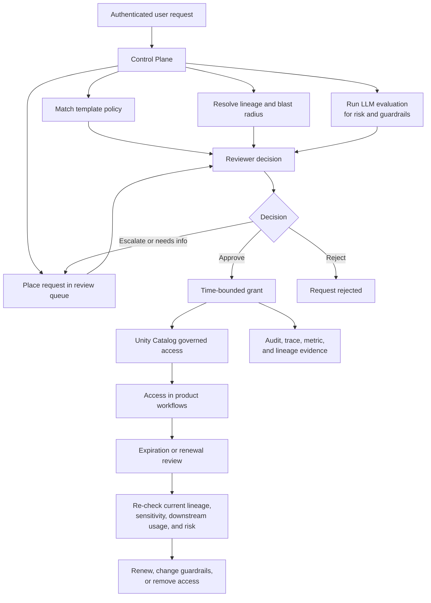

## Synthetic Engine

The synthetic engine gives users a safe sandbox while governed data access is
being reviewed. Mizumi has many tools to make access review faster and better:
template policies, review queues, blast-radius analysis, LLM evaluation, and
time-bounded grants. Even with those tools, human-in-the-loop governance still
takes time because reviewers need to understand risk before exposing sensitive
data.

Instead of forcing users to wait before learning whether an idea is useful, the
synthetic engine provisions near-real sandbox data. It reads catalog metadata,
table shape, column meaning, relationships, constraints, and business context,
then uses LLM and GAN techniques to generate data that behaves like the real
domain without exposing the real records. The generated data should preserve
useful structure such as distributions, categories, joins, event patterns, and
business semantics, while avoiding direct leakage of sensitive source data.

This lets users experiment early. They can build a dashboard, prototype a
query, test a feature idea, validate a workflow, or explore a business question
against sandbox data while the real access request is still waiting for review.
The important output is not only a temporary dataset; it is the user's intent
made concrete. By the time the user submits the workflow for real access, the
reviewer can see what they want to do, which tables are involved, what outputs
will be produced, and what business value the request supports.

That improves governance. Reviewers no longer evaluate an abstract request like
"please give me access to this table." They can evaluate a concrete workflow
with proposed queries, charts, derived outputs, lineage, expected access needs,
and synthetic results. The control plane can attach blast-radius evidence, LLM
evaluation, and time-bounded access recommendations to that workflow, making
approval or rejection faster and better informed.

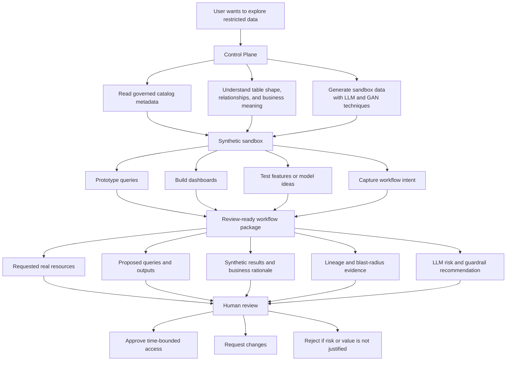

## Batch and Streaming Compute

Dagster owns repeatable data assets and launches containerized compute for
materializations. Spark and Daft perform the actual data processing. This keeps
the orchestration layer focused on lineage, dependencies, scheduling, and
observability while allowing each workload to use the best engine for the job.

Spark is the primary engine for lakehouse transformations because it provides a
common SQL/DataFrame abstraction for large data processing and Delta-style table
workflows. Spark Structured Streaming is used for event pipelines because it
extends that model to streaming computations with fault tolerance and scalable
processing.

Spark streaming jobs are managed through the control plane. The web UI should
present streaming job state and actions through the product boundary rather than
interacting with the stream processor directly.

Daft uses a Ray cluster for distributed tasks such as ML training and
multimodal data processing. This gives Mizumi a compute path optimized for AI
datasets and model workflows, where records may include text, images, documents,
embeddings, and labels rather than only tabular lakehouse rows.

The batch flow is for repeatable medallion transformations. Source or synthetic
data lands in bronze storage, Dagster materializes the asset, Spark or Daft
performs the transformation, and the result is registered back into governed
metadata before it appears in product surfaces such as catalog, lineage,
permissions, and analytics.

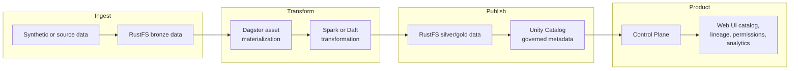

The streaming flow is for continuously arriving business events. Producers send
events into the event layer, Spark Structured Streaming processes them into
governed outputs, Unity Catalog tracks the resulting assets, and the control
plane exposes job state and product workflows to the web UI.

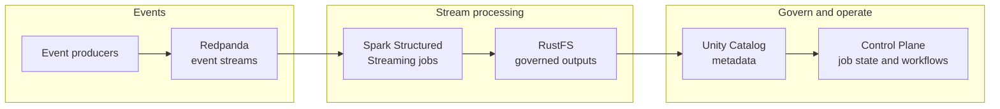

## Interactive Query

DuckDB provides the interactive SQL path for exploratory analytics and product
query sessions. Mizumi uses DuckDB instead of Spark or Daft for this surface
because interactive work needs a fast, low-cost query engine that can inspect
many data types without starting heavier distributed compute. DuckDB can work
with tabular files, documents, object-backed data, and vector-oriented
extensions, making it a good fit for user-driven exploration across CSV,
document-derived datasets, vectors, and lakehouse tables.

Mizumi uses DuckDB's Quack remote protocol for this
surface. Quack turns DuckDB into a remote SQL service that DuckDB clients can
connect to over HTTP, which is a better architectural fit than maintaining a
custom query transport around embedded DuckDB instances.

The intended flow is:

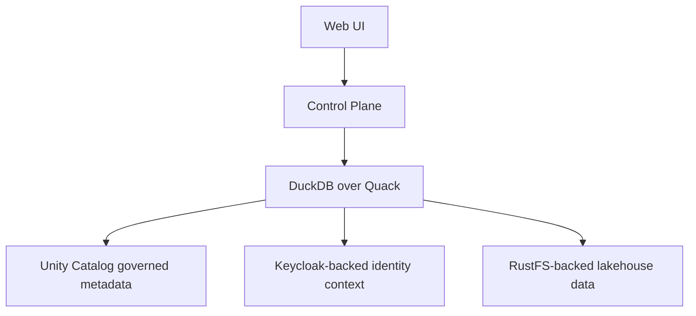

The control plane remains responsible for identity-aware session decisions,
governed access, DuckDB instance lifecycle, and product-level query state. It
manages DuckDB instances so interactive capacity can be created only when it is
needed and released when sessions end, reducing cost compared with keeping
larger Spark or Daft execution capacity active for ad hoc exploration. DuckDB
remains responsible for SQL execution, while Unity Catalog and Keycloak provide
the governance and identity context for those sessions.

## ML

ML workflows are governed through Unity Catalog, tracked through MLflow, served
through Ray distributed serving, and orchestrated through Dagster. RustFS stores
model artifacts and related assets, while the control plane coordinates how
model workflows are surfaced in the product.

Unity Catalog gives ML assets the same governance model as data assets, so
models, features, training datasets, and related resources can be managed with
permission-aware metadata. MLflow records experiments, metrics, artifacts, and
model registry state so model development remains reproducible and inspectable.

Daft and Ray provide the distributed execution layer for ML training and
multimodal data preparation. Daft processes classified and labeled multimodal
data, including text, images, documents, embeddings, and tabular features. Ray
provides distributed execution for training and model serving, including online
serving paths where inference capacity needs to scale independently from batch
data processing.

Dagster automates retraining by treating model refreshes as governed assets.
Retraining can consume classified and labeled data processed by Daft, near
real-time events from Spark streaming jobs, and curated features from the
feature store. This design keeps model updates close to fresh operational
signals while preserving lineage, evaluation, and governance around every model
version.

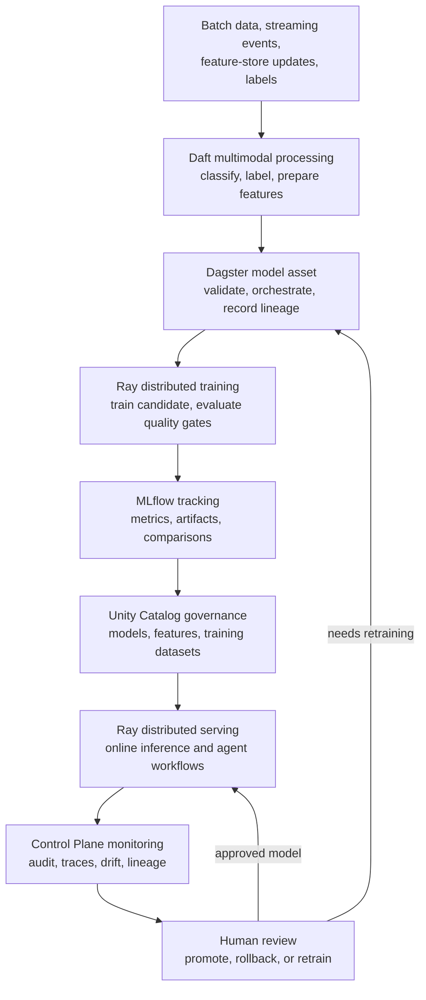

## Context Awareness

LanceDB is used for hybrid search, full-text search, and vector search. It fits
Mizumi's architecture because its storage model works well with object-backed
data, and it supports AI retrieval workflows without requiring the platform to
introduce a separate heavyweight search stack.

LanceDB also turns Mizumi into a context-awareness system for AI agents. By
indexing governed business data, documents, derived features, model artifacts,
and operational knowledge, agents can retrieve the context needed to answer
questions across the platform. Employees can build and query their own
knowledge context, while managers can use their authorized organizational
context to understand team work, decisions, datasets, and operational state by
asking an agent instead of waiting for status updates or chasing engineering
owners for every detail.

LanceDB is managed through the control plane. The web UI should request context
retrieval, indexing, and discovery workflows through the product boundary so
agent context behavior can remain governed and auditable.

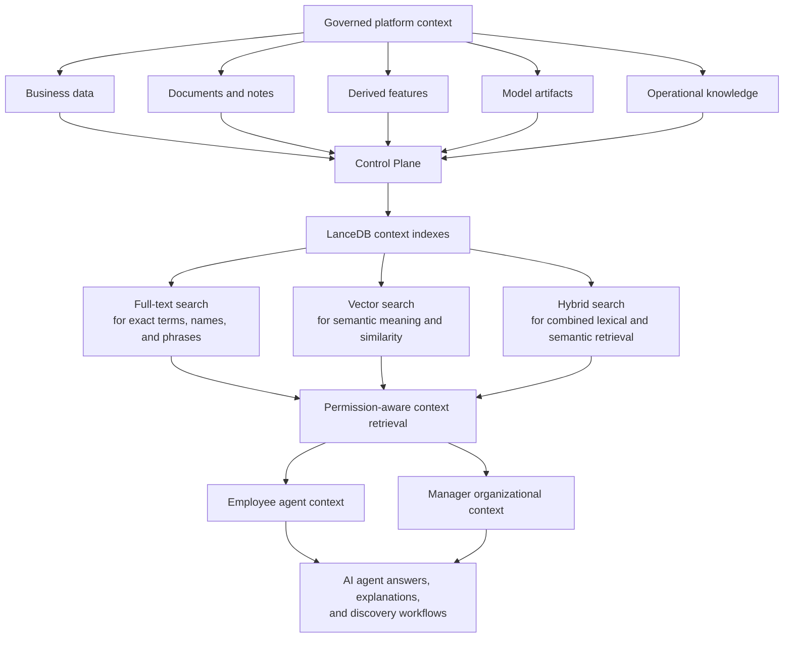

## Agent

The agent is the natural-language interface to Mizumi's governed platform
context. It helps non-technical users ask questions about data, generate
queries, visualize results, discover relevant datasets, understand lineage, and
request access without needing programming knowledge.

The agent is powerful because it can draw on the platform's full context:
catalog metadata, governed datasets, lineage, audit evidence, model context,
business documents, operational state, and prior workflow decisions. That does
not mean the agent can see or do everything. Its answers and actions are
permission-aware. Unity Catalog governs which data and resources the user can
access, Keycloak establishes the user's identity, and the control plane
mediates every action that changes state or touches governed resources.

The agent should use self-hosted open-source LLMs, such as DeepSeek or
Kimi-class models, for sensitive enterprise workflows. Running the model inside
the Mizumi environment keeps prompts, retrieved context, query results, and
governed data inside the platform instead of sending them to an external model
provider. This preserves the agent experience while keeping data residency and
governance aligned with Unity Catalog and control-plane policy.

Agent usage also compounds company knowledge over time. Every governed
question, approved answer, useful visualization, access request, correction,
and workflow outcome can improve the company's context graph when it is
captured with the right permissions and review controls. This growing context
becomes company intellectual property: a living map of business meaning,
decisions, datasets, metrics, workflows, and operational know-how that becomes
more valuable as employees use the agent.

This makes the agent a productivity layer instead of a governance bypass. When
a user asks a question, the agent can query only accessible data. When useful,
it can route interactive analysis through DuckDB, retrieve platform context
through LanceDB, explain lineage and blast radius, produce a chart, summarize a
model or pipeline, or prepare an access request for review. If the user lacks
access, the agent should explain what is missing and help start the governed
access workflow rather than exposing restricted data.

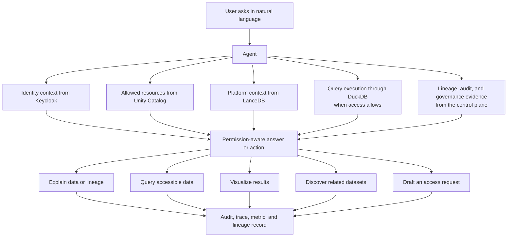

## Dashboard

The dashboard is the agent-facing analytical workspace. It replaces the
traditional handoff where a business user explains a need to an analyst, the
analyst searches for data, writes queries, builds charts in a separate BI tool,
and then sends results back later. In Mizumi, the business user can describe
the decision they are trying to make, and the agent can translate that intent
into governed data discovery, query execution, visualization, and explanation.

This does not remove governance. It removes the middleman for routine
exploration. The agent still operates through Unity Catalog, Keycloak, and the
control plane. If the user has access, the agent can query the right data and
create panels. If the user does not have access, the agent can explain what is
missing, prepare the access request, show the expected blast radius, and wait
for approval or rejection.

The dashboard should feel collaborative rather than static. A manager can ask
the agent to explain a chart in place, compare panels, identify the driver of a
metric, change a visualization, or add a new view without chasing an engineer
or data analyst. Because the agent has platform context, it can reason about
business meaning, lineage, sensitivity, model outputs, and operational state
instead of only rendering numbers.

The dashboard is also a learning surface. Each useful panel, explanation,
correction, and follow-up question improves the company's governed context
when captured as evidence. Over time, dashboards become part of the company IP:
more than charts: reusable decision context, business definitions, metric
interpretations, and collaboration history.

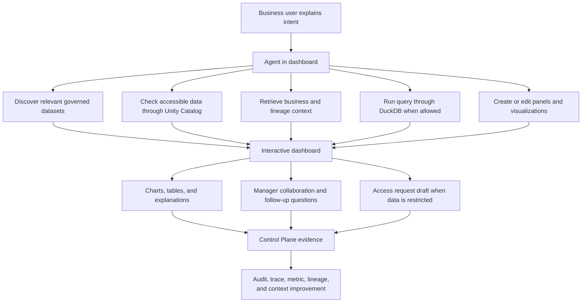

## Identity and Access Flow

Keycloak authenticates users using standard identity protocols. The web UI uses
that identity context to present authenticated product flows, while the control
plane evaluates what the user can do inside Mizumi.

The design separates authentication from platform authorization:

- Keycloak proves who the user is.
- The control plane decides what platform workflow the user may perform.
- Unity Catalog governs access to data and related resources.
- RustFS stores data and artifacts but does not become the product permission
  model.

This keeps identity, governance, and storage concerns cleanly separated while
still producing a coherent user experience.

## Auditing, Tracing, Metrics, and Lineage

Because the control plane manages product workflows across identity, catalog,
storage, compute, query, ML, and context-awareness systems, it is the natural
place to build platform-wide evidence. Every important user action and system
action can be represented as a control-plane event with identity context,
resource context, policy context, timing, outcome, and downstream effects.

This makes the control plane the audit and trace boundary for Mizumi:

- Audit logs explain who did what, when it happened, what resource was affected,
  and whether the action was allowed, denied, completed, or failed.
- Traces connect one product action to the backend systems it touched, such as
  catalog changes, storage writes, query sessions, streaming job updates,
  model retraining, or context indexing.
- Metrics aggregate platform behavior, including workflow volume, latency,
  failures, retraining activity, query usage, streaming health, cost signals,
  and context retrieval quality.
- Lineage connects inputs, transformations, models, features, derived datasets,
  context indexes, model outputs, agent answers, and user-facing results so
  teams can understand where an answer came from and what may be affected by a
  change.

The design goal is that users should not need to inspect each backend system
separately to understand what happened. The control plane should provide a
single governed explanation layer for operational health, compliance review,
debugging, impact analysis, and trust in AI-generated answers.

These evidence records should also be cataloged as governed platform data.
Audit events, trace summaries, metric rollups, and lineage edges can become
catalog-visible evidence assets with clear ownership, retention, access
controls, and downstream relationships. This makes the platform's own behavior
queryable and reusable for governance, reliability, cost management, and AI
context.

Over time, this creates a self-improvement loop. Mizumi can audit its own
workflows, detect recurring failures or unclear ownership, identify stale
lineage, surface risky permission patterns, and recommend improvements to data,
models, prompts, workflows, or policies. Human review remains the control
point: the system can propose, explain, and prioritize enhancements, while
people approve policy changes, model promotions, remediation actions, and
workflow redesigns.

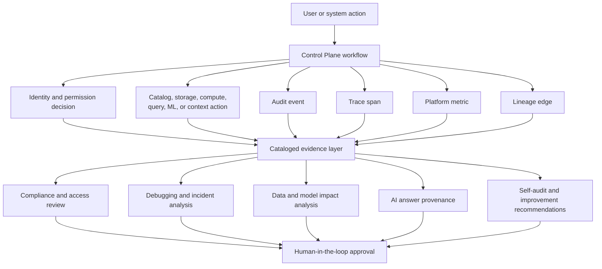

## Design Principles

1. The control plane is the product boundary.

   User-facing behavior should flow through the control plane so authorization,
   auditability, orchestration, and cross-system state are consistent.

2. Specialized systems stay specialized.

   Keycloak authenticates, Unity Catalog governs, RustFS stores, Dagster
   orchestrates, Spark and Daft compute, DuckDB queries, LanceDB retrieves
   context, and MLflow tracks models. Mizumi's product behavior comes from how
   the control plane composes these systems.

3. Object storage is the shared data plane.

   Durable data and artifacts live in RustFS so compute engines can be replaced
   or added without redesigning storage.

4. Governance is metadata-led.

   Unity Catalog is the authority for governed resources and permissions. Data
   access should be expressed through catalog resources rather than implicit
   storage paths.

5. Compute is ephemeral by default.

   Batch, ML, and streaming workloads should run as managed workloads rather
   than being embedded in the web UI or control plane process.

6. Interactive SQL uses DuckDB Quack.

   DuckDB should be exposed through its official remote protocol so query
   sessions use a supported client-server architecture.

7. Product flows are identity-aware.

   Keycloak handles authentication, but the control plane applies that identity
   to product permissions, governed access, workflow state, and audit decisions.

8. Evidence is captured at the workflow boundary.

   The control plane should record audit logs, traces, metrics, and lineage for
   platform workflows so users can understand what happened, why it happened,
   what changed, and what downstream systems or AI answers were affected.

9. Agents are governed product actors.

   The agent can help users ask, analyze, visualize, discover, and request
   access, but it should operate through Unity Catalog, Keycloak, and the
   control plane rather than bypassing platform governance.

10. Dashboards are conversational decision surfaces.

    Dashboards should let business users describe decisions, ask follow-up
    questions, and collaborate in place. The agent should translate intent into
    governed discovery, query, visualization, explanation, and access-request
    workflows instead of requiring a separate BI or analyst handoff for routine
    exploration.

11. Synthetic sandboxes reduce review waiting time.

    Users should be able to experiment with near-real sandbox data while real
    access is still under review. The synthetic workflow should make intent,
    proposed outputs, and business value clearer so human reviewers can make
    better decisions with less back-and-forth.

## Extension Points

- Add a data product by adding governed assets, registering catalog metadata,
  defining materializations, and exposing the workflow through the control
  plane and web UI.
- Add a compute engine by packaging it as a managed workload and connecting it
  either to Dagster for repeatable assets or to the control plane for
  interactive product workflows.
- Add a governed resource type by extending the catalog model, control plane
  workflow, and web UI surface together.
- Add an ML workflow by writing RustFS-backed processing jobs, governing model
  and feature assets through Unity Catalog, tracking runs in MLflow, using Daft
  with Ray for distributed training or multimodal processing, serving models
  with Ray, and automating retraining through Dagster when fresh labels,
  streaming events, or feature-store updates are available.
- Add a context-awareness workflow by storing searchable representations in
  LanceDB and exposing full-text, vector, and hybrid retrieval actions through
  the control plane.
- Add an agent workflow by defining the user intent it supports, the governed
  context it may retrieve, the actions it may take, and the audit evidence it
  must produce through the control plane.
- Add a dashboard workflow by defining the business question, the governed data
  it may use, the panel or visualization behavior, the access-request fallback,
  and the explanation/audit evidence the agent should produce.
- Add a sandbox data workflow by generating near-real data with GAN or LLM
  techniques from governed catalog metadata, registering the resulting sandbox
  assets, and packaging the user's prototype queries, dashboards, rationale,
  lineage, and blast-radius evidence for review.
